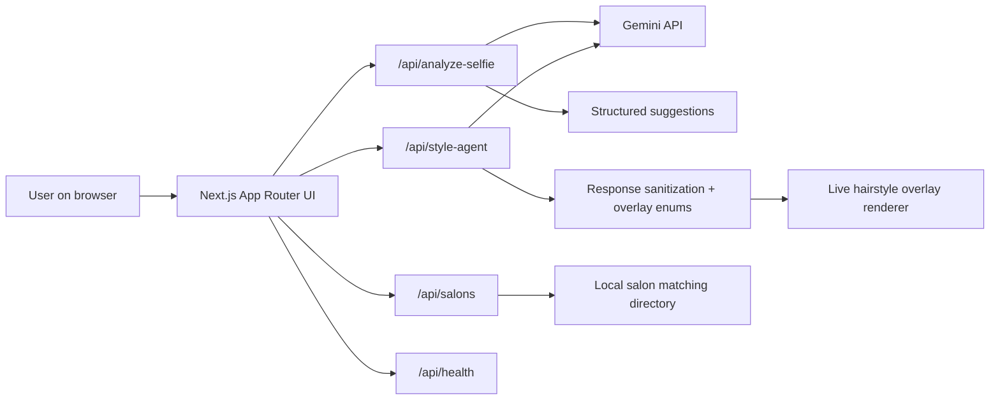

# HairMatch Live

HairMatch Live is a Gemini hackathon prototype for the Gemini Live Agent Challenge. It turns a selfie or webcam feed into a live hairstyling session: Gemini analyzes the portrait, proposes flattering cuts, a live style agent remixes the look from spoken or typed preferences, and the app hands the user into matched salons with a stylist-ready recommendation.

## Why This Project Fits The Challenge

- Live multimodal interaction: selfie upload, webcam preview, spoken preference capture, spoken agent replies, and visual hairstyle mashups in one flow.
- Polished user experience: the app behaves like a premium salon consultation rather than a tooling demo.
- Robust agent architecture: a dedicated style-agent route maintains short session memory and produces structured overlay instructions.
- Grounded responses: the agent is constrained to an available suggestion set and sanitized into typed overlay enums before rendering.
- Demo readiness: the story is simple to narrate live from portrait upload through salon handoff.
- Google Cloud readiness: the app now includes a containerized Cloud Run deployment path and a health endpoint for service checks.

## Core User Flow

1. Upload a portrait in the studio.
2. Gemini analyzes the selfie and returns three hairstyle suggestions.
3. The user opens the live stylist studio and optionally enables the webcam.
4. The user speaks or types preferences such as "keep length but add softness and lower maintenance."
5. The style agent picks one candidate style, produces a short spoken response, and emits a structured overlay config.
6. The UI renders the live hairstyle overlay and recommends salons matched to the selected cut profile.

## Architecture



## Stack

- Next.js 14 App Router
- React 18
- TypeScript
- Tailwind CSS
- Framer Motion
- `@google/genai`

## Local Development

### Prerequisites

- Node.js 20+
- npm 10+
- A Gemini API key

### Environment

Create `.env.local` with:

```bash
GEMINI_API_KEY=your_key_here
```

Without `GEMINI_API_KEY`, the app still works in demo mode with safe fallback hairstyle suggestions and a fallback style-agent response.

### Run

```bash
npm ci
npm run dev
```

Open [http://localhost:3000](http://localhost:3000).

## API Surface

- `POST /api/analyze-selfie`: accepts `multipart/form-data` with `file`, returns hairstyle suggestions.
- `POST /api/style-agent`: accepts preference text, current style, available suggestions, and recent conversation turns.
- `POST /api/style-board`: accepts the selected look, stylist brief, and optional selfie reference, then returns a generated style-board image.
- `GET /api/salons?style=...&location=...`: returns local demo salon matches.
- `GET /api/health`: returns service status and deployment-readiness metadata for local checks or Cloud Run probes.

## Google Cloud Deployment

### Container Build

```bash
docker build -t hairmatch-live .
docker run -p 3000:3000 -e GEMINI_API_KEY=$GEMINI_API_KEY hairmatch-live
```

### Cloud Run

```bash
gcloud config set project YOUR_GCP_PROJECT
gcloud builds submit --tag gcr.io/YOUR_GCP_PROJECT/hairmatch-live
gcloud run deploy hairmatch-live \
  --image gcr.io/YOUR_GCP_PROJECT/hairmatch-live \
  --region asia-southeast1 \
  --allow-unauthenticated \
  --set-env-vars GEMINI_API_KEY=$GEMINI_API_KEY
```

### Cloud Build To Cloud Run

The repo now includes a judge-ready Cloud Build pipeline and a Cloud Run service manifest:

- `cloudbuild.yaml`: builds the container, pushes it, and deploys to Cloud Run with a Secret Manager-backed Gemini key.
- `deploy/cloudrun-service.yaml`: declarative Cloud Run service template with health probes, gen2 execution, and warm-instance defaults.

Suggested setup:

```bash
printf '%s' "$GEMINI_API_KEY" | gcloud secrets create gemini-api-key --data-file=-
gcloud builds submit --config cloudbuild.yaml
```

Recommended for judging and demo stability:

- Region: `asia-southeast1` for Singapore proximity.
- Instance baseline: `--min-instances=1` to reduce cold starts.
- Concurrency: lower concurrency if you want steadier live-demo response behavior.
- Secret management: move `GEMINI_API_KEY` into Secret Manager for any non-demo deployment.

### Health Check

After deployment:

```bash
curl https://YOUR_SERVICE_URL/api/health
```

Expected signals:

- `status: "ok"`
- `runtime: "nodejs"`
- `config.geminiApiKeyConfigured: true` in live mode
- `deploymentTarget: "google-cloud-run"` when deployed on Cloud Run
- `challengeReadiness.googleCloudDeploymentPath: true`
- `revision` set to the active Cloud Run revision identifier

## Demo Script

1. Start on the hero and frame HairMatch Live as an AI salon consultation.
2. Upload a portrait and show Gemini returning tailored suggestions.
3. Open the live stylist studio and switch on the webcam.
4. Speak a preference like "keep it soft and camera-ready, but easier to maintain."
5. Let the agent respond out loud and point out that the overlay updates from structured agent output.
6. Finish with salon matches and explain the stylist-ready handoff.
7. Close with the Cloud Run deployment path and health endpoint to show this is not only a front-end mock.

## Current Strengths

- Strong visual presentation for a short live demo
- Clear multimodal story: see, speak, hear
- Safe fallback behavior when Gemini is unavailable
- Typed overlay pipeline that keeps agent output renderable

## Known Gaps

- Hairstyle overlay is stylized and not face-landmark anchored yet.
- Browser speech features depend on Chrome-family APIs.
- Salon matching is currently a curated local demo directory rather than live Maps-backed inventory.
- The app uses the Gemini Generative AI SDK today; a fuller Gemini Live API path would strengthen challenge alignment further.

## Repo Notes

- `src/components/LiveStyleStudio.tsx`: live camera, speech capture, voice reply, and session memory UX
- `src/lib/gemini.ts`: Gemini selfie analysis, style-agent generation, and style-board image generation
- `src/lib/styleStudio.ts`: overlay heuristics and fallback agent behavior
- `src/app/api/health/route.ts`: deployment-readiness and runtime probe
- `cloudbuild.yaml`: one-command Cloud Build to Cloud Run pipeline
- `deploy/cloudrun-service.yaml`: declarative Cloud Run service settings for demo stability
- `docs/google-cloud-demo-readiness.md`: judge-facing architecture, proof points, and verification steps

## Validation Checklist

- `npm run lint`
- `./node_modules/.bin/tsc --noEmit`
- `npm run build`
- Manual browser pass across portrait upload, live stylist agent, and salon handoff
