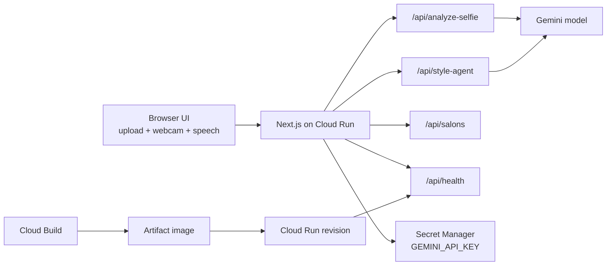

# Google Cloud Demo Readiness

## Recommended judge-facing architecture



## Why this matters for judging

- Shows a real Google Cloud deployment path rather than a laptop-only demo.
- Keeps the live-agent app in a single Cloud Run service, which is easier to demo and reason about.
- Uses Secret Manager for the Gemini key so the deployment story is production-shaped.
- Adds a health endpoint that exposes runtime, revision, and challenge-readiness signals for live verification.

## Fast deploy path

1. Create the secret once:

```bash
printf '%s' "$GEMINI_API_KEY" | gcloud secrets create gemini-api-key --data-file=-
```

2. Submit the build and deploy pipeline:

```bash
gcloud builds submit --config cloudbuild.yaml
```

3. Verify the service:

```bash
curl https://YOUR_SERVICE_URL/api/health
```

## Judge demo proof points

- Show `challengeReadiness.googleCloudDeploymentPath` from `/api/health`.
- Show `revision` and `deploymentTarget` to prove the running Cloud Run revision.
- Mention `asia-southeast1` and `minScale: 1` as latency and cold-start mitigation choices for live judging.
- If using fallback mode, say the UX remains demo-safe; if `liveModelConfigured` is true, call out that Gemini-backed responses are active.
